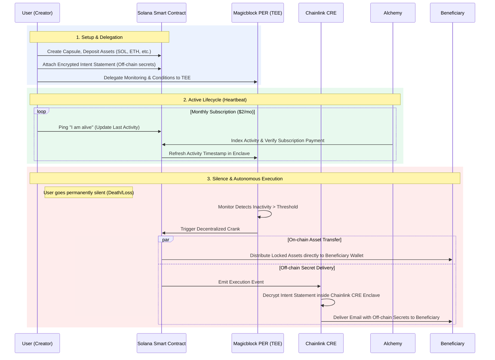

# Heres - Privacy-Preserving Death Insurance Protocol on Solana

> **People disappear. Intent should not.**

Heres is a **Privacy-Preserving Death Insurance Protocol on Solana**, where your digital assets remain securely delegated, conditions stay completely private inside **Magicblock Private Ephemeral Rollups (PER / TEE)**, and execution happens automatically when silence becomes truth. 

Beyond on-chain assets, Heres introduces a **"Confidential Bridge" via Chainlink CRE (Chainlink Runtime Environment)** to securely and autonomously deliver encrypted off-chain *Intent Statements* (such as legacy messages, vault passwords, or recovery codes) directly to your beneficiaries without any middlemen.

---

## Background

As digital asset ownership grows, a critical gap has emerged: **what happens to your crypto and your intentions when you can no longer manage them?** Traditional estate planning rarely covers bearer assets controlled by private keys, and leaving keys with a third party creates severe security and privacy risks. 

At the same time, **confidential computing** has become a major focus in crypto infrastructure. Heres sits at this exact intersection: it acts as decentralized **death insurance**, utilizing **time-locked intent capsules** on Solana with **hardware-grade private execution** via Magicblock’s TEEs. Your “if I go silent” instructions are enforced automatically and privately, providing an institutional-grade digital succession layer.

---

## Market Research & Trends

### 1. The "Digital Graveyard" Epidemic
- **Scale of the problem:** Every year, an estimated $2.1 Billion in digital assets is permanently lost because owners pass away without a secure succession plan. Cryptocurrencies are bearer assets: without proper automated execution, heirs cannot recover holdings.
- **Implication for Heres:** We focus on **programmatic death insurance**: define conditions (e.g., heartbeat inactivity period, beneficiaries) once; execution is automatic when conditions are met, ensuring zero lost wealth.

### 2. Decentralized Confidential Computing (DeCC) & TEEs
- **TEE role:** Trusted Execution Environments (TEEs) provide hardware-enforced isolation so that conditions and data can be evaluated **in use** without exposing them on a public ledger.
- **Implication for Heres:** We use Magicblock’s **PER (TEE)** so that inactivity checks and beneficiary logic run inside a trusted enclave. Absolute privacy while alive; transparent execution only upon death or permanent absence.

### 3. The Flight to Stability in Estate Planning
- **Stablecoin Adoption:** When planning for beneficiaries who may not be crypto-native, minimizing volatility is key. 
- **Implication for Heres:** We prioritize major stablecoins (USDC, USDT, solAUDD) alongside blue-chip crypto, ensuring that the legacy left behind retains its real-world purchasing power.

---

## Overview & Asset Roadmap

**Heres** lets you create **Intent Capsules** on Solana. You deposit premium assets, set an **inactivity period**, assign **beneficiaries**, and securely attach encrypted **Intent Statements** via Chainlink. You delegate the capsule to Magicblock PER (TEE). Your **conditions stay completely private** inside the enclave; when you have been inactive long enough, **execution is automatic**.

### Supported Assets Roadmap
To ensure maximum flexibility for users, Heres Protocol is designed to support an expanding array of assets, from native tokens to wrapped assets and yield-bearing instruments.

| Phase | Asset Category | Examples | Status |
|-------|----------------|----------|--------|
| **Phase 1** | Solana Assets | SOL, wallet-held classic SPL, Token-2022, standard Solana NFTs | Live on devnet |
| **Phase 2** | Curated Mainnet Assets | USDC, USDT, wBTC, JitoSOL, mSOL | Upcoming |
| **Phase 3** | Yield-Bearing & DeFi Assets | LP Tokens, Vault Shares | Roadmap |
| **Phase 4** | Real World Assets (RWA) | Tokenized Treasuries, Real Estate | Roadmap |

### Technical Architecture
| Layer | Technology | Role |
|-------|------------|------|
| **Settlement** | **Solana** | Persistent capsule state (owner, vault, inactivity, delegation), asset locking. |
| **Private Sentinel** | **Magicblock PER (TEE)** | Hardware-isolated private monitoring of conditions; triggers the Crank when conditions are met. |
| **Confidential Bridge** | **Chainlink CRE** | Secure off-chain delivery of encrypted Intent Statements to beneficiaries exactly where they need to go. |
| **Monitoring** | **Alchemy** | Robust on-chain indexing and webhooks to ensure stable heartbeat tracking, subscription processing, and system liveliness. |

---

## Problem

1. **Digital Asset Succession:** Crypto is a bearer-asset. If you disappear, heirs cannot access your assets without complex technical knowledge.
2. **Transparent Conditions:** Putting “if I don’t log in for X days, send Y to Z” on a public chain exposes your beneficiaries and wealth to surveillance and front-running risks.
3. **The Web2 Gap:** Estates encompass sensitive Web2 credentials (passwords, 2FA codes) that cannot be safely stored on public networks.
4. **Trust in Executors:** Relying on a person, lawyer, or centralized institution introduces severe counterparty risk, human error, and friction.

---

## Solution

Heres is an autonomous orchestration framework combining:

1. **Persistent Capsules** – A PDA vault locks your assets securely on-chain.
2. **Private Execution Logic** – Inactivity and beneficiary checks run inside Magicblock **PER (TEE)**, keeping conditions completely private off-chain until executed.
3. **Confidential Delivery (Chainlink CRE)** – An encrypted off-chain *Intent Statement* is attached at creation. When the capsule activates, Chainlink CRE retrieves and delivers the decrypted statement directly to the beneficiary's email.
4. **Protocol Insurance Fund (PIF)** – 50% of protocol revenue is directed to an on-chain SAFU fund, providing institutional-grade financial assurance against technical failures.

---

## Key Features

- **Zero Trust Executor (Code is Law):** No human intervention, lawyers, or third parties hold your keys. The smart contract acts as an uncompromising, immortal executor.
- **Enclave-level Privacy:** Beneficiary addresses, trigger conditions, and asset distributions stay completely hidden inside the TEE while you are alive. Your financial privacy is never compromised.
- **Off-chain Confidential Bridge:** Unique integration with Chainlink's isolated CRE allows us to securely decrypt and push Web2 secrets (emails, final letters) off-chain, bridging the gap between blockchain assets and real-world heirs.
- **Absolute Owner Sovereignty (Heartbeat Override):** The creator can update their heartbeat, add or withdraw vault assets, and cancel an undelegated capsule before it fires. Beneficiary and NFT settlement rules become immutable when a new capsule is sealed.
- **Multi-Asset Protection:** A fungible vault can hold SOL plus wallet-held classic SPL and compatible Token-2022 mints under one beneficiary split. Standard Solana NFTs use explicit per-mint recipients.
- **Sealed Settlement Rules:** New capsules seal beneficiary shares and NFT assignments inside the TEE, then arm the liveness switch with a matching commitment so the payout configuration cannot change after activation.
- **Self-Sustaining Protocol:** Designed with a hyper-sustainable subscription model that heavily funds a Protocol Insurance Fund (PIF) to protect users from unforeseen smart-contract vulnerabilities.

---

## Business Model & Economics

Heres Protocol operates on a highly sustainable and predictable revenue model designed to scale TVP (Total Value Protected):

- **Capsule Limitation:** Each wallet manages **one current capsule**. After execution, distribution, intent delivery, and finalization close that lifecycle, the wallet can create a fresh capsule at the same addresses.
- **Creation Fee:** The current repository default is **0.05 SOL** per capsule and remains configurable through the on-chain fee account.
- **Planned Subscription Fee:** The product model targets a **$2 monthly subscription fee** to maintain the active heartbeat monitor; this branch does not add on-chain subscription enforcement.
- **Planned 50% SAFU Allocation:** The product model directs half of protocol revenue to the **Protocol Insurance Fund (PIF)**.

---

## User Flow & Architecture

The following diagram illustrates the complete lifecycle of a Heres Intent Capsule, from creation to the autonomous delivery of assets and secrets upon permanent inactivity.



The diagram is a product-level overview. The current devnet lifecycle creates an inactive draft, seals the private inheritance configuration in the TEE, arms the switch with its commitment, and finalizes the three core accounts only after every asset and enabled Intent Statement has settled.

---

## Build & Deploy (Devnet)

Reference for rebuilding and redeploying the on-chain program (`heres_program`). These are the exact tools and versions used for the current devnet deployment.

### Toolchain

| Tool | Version | Notes |
|------|---------|-------|
| Solana CLI (Agave) | `4.0.3` | `solana --version` |
| platform-tools | **`v1.54`** | Required for the program build. Do NOT use the `v1.53` that agave 4.0.3 bundles by default (see the gotcha below). |
| `cargo-build-sbf` | `4.0.0` | Ships with Agave 4.0.3; pin the build toolchain with `--tools-version v1.54`. |
| Rust (platform-tools v1.54) | `1.89.0` | Bundled in v1.54. |
| Anchor CLI | `1.0.0` | `anchor --version` |

Program crate dependencies (`programs/heres_program/Cargo.toml`):

| Crate | Version | Features |
|-------|---------|----------|
| `anchor-lang` | `0.32.1` | `init-if-needed` |
| `anchor-spl` | `0.32.1` | `token_2022` |
| `ephemeral-rollups-sdk` | `0.14.4` | `anchor-compat`, `access-control` |
| `magicblock-magic-program-api` | `0.10.1` | `backward-compat` |
| `bincode` | `1.3` | |

### Build

Devnet requires programs to be deployed as **SBPFv3**. Build with platform-tools v1.54 and the v3 target:

```bash
cd heres_program
cargo-build-sbf --tools-version v1.54 --arch v3
# -> target/deploy/heres_program.so
# verify the version: readelf -h target/deploy/heres_program.so | grep Flags  ->  Flags: 0x3
```

The current deployment was built with `cargo-build-sbf` directly. To also regenerate the Anchor IDL, run `anchor build` and forward the same flags: `anchor build -- --tools-version v1.54 --arch v3`.

### Deploy (in-place upgrade)

```bash
solana program deploy heres_program/target/deploy/heres_program.so \
  --program-id heres_program/target/deploy/heres_program-keypair.json \
  --upgrade-authority <UPGRADE_AUTHORITY_KEYPAIR> \
  --fee-payer <UPGRADE_AUTHORITY_KEYPAIR> \
  --url https://api.devnet.solana.com \
  --with-compute-unit-price 50000 --max-sign-attempts 1000
```

Program ID (devnet): `sDRdG2qt6MKDB5Byfx7oqQLnZTDa32k1qM3hDSBmQUz`

### Gotcha: do not build v3 with platform-tools v1.53

`agave 4.0.3` bundles **platform-tools v1.53, whose SBPFv3 codegen is broken**. A `v1.53 --arch v3` binary passes the loader's deploy verification and lands on-chain, but then crashes on every instruction at runtime (`Access violation in unknown section ...`, ~44 compute units, before the handler runs). Always build v3 with **`--tools-version v1.54`**, and verify the deployed bytecode by dumping it (`solana program dump <PROGRAM_ID> out.so`) and confirming its sha256 matches your local `.so`.

### Notes

- Devnet rejects SBPFv0/v1/v2 deploys (`Detected sbpf_version ... not enabled`); v3 is required. Programs already deployed as v0 still execute, but cannot be redeployed as v0.
- If a deploy fails, close the orphan buffer before retrying so its rent is reclaimed: `solana program close <BUFFER_ADDRESS> --authority <AUTH> --recipient <AUTH>`.

---

## Documentation

- [Architecture and smart contract reference](ARCHITECTURE.md)
- [GitBook documentation](gitbook/SUMMARY.md)
- [Chainlink CRE integration notes](CRE_README.md)
- [Program test strategy](heres_program/tests/README.md)
- [MagicBlock live-devnet verification](scripts/magicblock/README.md)
- [Android MVP setup](mobile-android/README.md)
- [Project-local Solana security review registration](.agents/skills/solana-security-review/SKILL.md)
- [Vendored Chainlink CCIP Solana SDK reference](vendor/ccip-svm/README.md)
